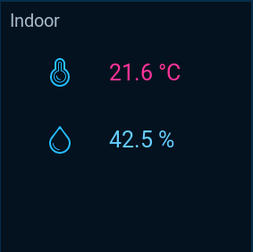
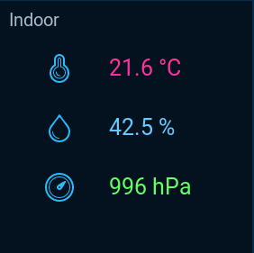
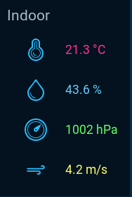
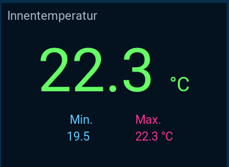

**IMPORTANT: You need to copy the ```html``` folder to your ```<openhab>/conf/``` folder.**

In the ```rules``` folder you can find example rules for use with these widgets.

### Compact Widget Preview:





### Temperature Widget Preview:



### Wind Widget Preview:


